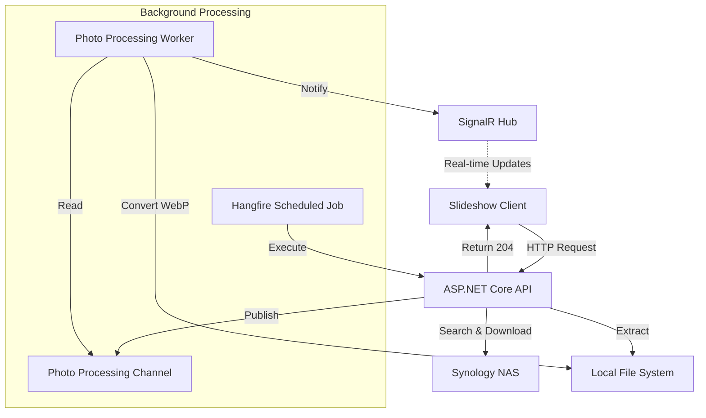

# PROJECT INSTRUCTIONS

NOTE TO AI: This file is symlinked to CLAUDE.md and GEMINI.md. When modifying this file, preserve all sections, including those intended for other AI tools. Do not overwrite the entire file; only edit relevant sections and specify if the operation is unique to which AI tool.

## Project Overview

.NET 10 ASP.NET Core API that downloads random photos from a Synology NAS, converts them to WebP format, and serves them for a slideshow client. Uses SignalR for real-time client notifications, Hangfire for scheduled background jobs, and channel-based workers for async photo/thumbnail processing.

## Build & Run Commands

```bash
# Build
dotnet build

# Run (HTTP: 5097, HTTPS: 7078 in dev)
dotnet run --project src/Synology.Photos.Slideshow.Api

# Docker (includes Redis)
docker-compose -f docker-compose.yaml -f docker-compose.local.yaml up -d --build
```

## Testing

Unit tests are written using **TUnit** and **NSubstitute**.

```bash
# Run all tests
dotnet test

# Run tests with code coverage
dotnet test --collect "Code Coverage"

dotnet test -- --coverage --coverage-output-format cobertura --coverage-output coverage.cobertura.xml                                                                                                                                                     
dotnet reportgenerator \
-reports:"tests/Synology.Photos.Slideshow.Api.Tests/bin/Debug/net10.0/TestResults/coverage.cobertura.xml" \
-targetdir:"coverage-report" \
-reporttypes:"Html;TextSummary" \
-assemblyfilters:"+Synology.Photos.Slideshow.Api" \
-filefilters:"-**/obj/**;-**/*.generated.cs;-**/*.g.cs"
```

Tests are located in `tests/Synology.Photos.Slideshow.Api.Tests/UnitTests/` and organized by component: `AuthTests`, `ExtensionsTests`, `MessagingTests`, `ProvidersTests`, `ServicesTests`, and `ValidatorsTests`.

## Architecture

For a detailed breakdown of call flows and component interactions, see [Architecture Overview](docs/architecture.md).



### Request Flow

HTTP requests → CORS → `GlobalExceptionHandlerMiddleware` → `SynologyAuthenticationMiddleware` (extracts Synology auth token into HttpContext feature) → Minimal API endpoints under `/photos` group.

Photo download is async: endpoint queues work into a `System.Threading.Channels` unbounded channel → `PhotoProcessingWorker` / `ThumbnailProcessingWorker` (hosted services) consume and process → SignalR hub (`/hubs/slideshow`) notifies clients when done.

### Key Directories (under `src/Synology.Photos.Slideshow.Api/`)

- **Slideshow/Endpoints/** — Minimal API endpoint handlers (`GetSlides`, `DownloadPhotos`, `DeletePhotos`, `Thumbnails`)
- **Slideshow/Services/** — Core business logic: NAS search, file download/extraction, WebP conversion, EXIF metadata, geolocation
- **Slideshow/BackgroundServices/** — Channel consumers (`PhotoProcessingWorker`, `ThumbnailProcessingWorker`) with Polly retry
- **Slideshow/Jobs/** — Hangfire scheduled job (`PhotoDownloadJob`) for weekly auto-downloads
- **Slideshow/Messaging/** — Channel abstractions (`IPhotoProcessingChannel`, `IPhotoThumbnailProcessingChannel`)
- **Slideshow/Auth/** — Two auth patterns: `ISynologyAuthenticationContext` (scoped, from HTTP context) and `IBackgroundJobSynologyAuthentication` (transient, re-authenticates for background jobs)
- **Extensions/** — Service registration (`ConfigurationExtensions`), route mapping (`ConfigureEndpointsExtensions`), Hangfire setup
- **Configuration/** — Options classes bound from `appsettings.json` sections

### Patterns & Conventions

- **Follow clean code best practices** (e.g., Single Responsibility Principle, descriptive naming, extracting complex logic into helper methods)
- **FluentResults** `Result<T>` pattern for service-layer error handling (not exceptions)
- **FluentValidation** for request validation
- **Options pattern** with validation for all configuration sections
- **High-performance logging** via `[LoggerMessage]` partial methods (compile-time generated)
- **Serilog** structured JSON logging to `./logs/` with daily rolling files
- **HybridCache** (in-memory + optional Redis) for geolocation results
- **SixLabors.ImageSharp** for image processing: WebP encoding (75% quality photos, 60% thumbnails), EXIF extraction, auto-orientation, metadata stripping on thumbnails

### SignalR Client Methods

`RefreshSlideshow`, `PhotoProcessingError`, `RefreshGallery`, `ThumbnailsProcessingError` — all invoked from hub at `/hubs/slideshow`.

### API Endpoints

| Method | Route | Purpose |
|--------|-------|---------|
| GET | `/photos/download` | Trigger async photo download (returns 204) |
| GET | `/photos/slides` | Get photo metadata with URLs, dates, locations |
| GET | `/photos/thumbnails` | Get thumbnail relative URLs |
| POST | `/photos/bulk-delete` | Delete photos by name |
| GET | `/jobs` | Hangfire dashboard |

### Storage

No database — file system is the persistent store. Photos saved to `/app/slides` (configurable via `SynoApiOptions:DownloadAbsolutePath`). Hangfire uses in-memory storage.

### Configuration

Key `appsettings.json` sections: `UriBase` (NAS connection), `SynologyUser` (credentials), `SynoApiOptions` (search folders, download count/path), `ThirdPartyServices` (feature flags for geolocation/Redis), `GoogleMapsOptions` (geocoding API), `PhotoDownloadScheduledJobOptions` (weekly job schedule with timezone).

### No Authentication

API is designed for local network use only. CORS allows all origins.
