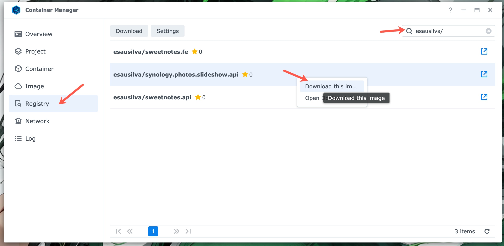

# Synology Photos Slideshow API

An API that downloads random photos from a Synology NAS, converts them to WebP, and serves them for slideshow clients.

## How it works

1. `GET /photos/download` authenticates with Synology, searches configured folders, downloads a random set, unzips, flattens the folder structure, and converts images to WebP.
2. Photos are served as static files under `/slideshow`.
3. `GET /photos/slides` returns metadata for the files currently in the slideshow folder.

The API is intended to run on your Synology NAS and be accessed only from your local network.

### Table of Contents:

  - [Endpoints](#endpoints)
    - [Download Photos](#download-photos)
    - [Get Photo Slides](#get-photo-slides)
    - [Bulk Delete Photos](#bulk-delete-photos)
  - [Logging](#logging)
  - [Local Development](#local-development)
  - [Docker (Local)](#docker-local)
  - [Deployment To Your Synology NAS Device](#deployment-to-your-synology-nas-device)
  - [Important !!!!!!!](#important)
  - [Future Enhancements](#future-enhancements)
  - [Client App](#client-app)
  - [Shameless Plug](#shameless-plug)
  - [Giving Back](#giving-back)

---

## Endpoints

Base URL (local dev): `http://localhost:5097` (HTTPS in dev only: `https://localhost:7078`)

Base URL (running on the NAS): `http://<nas-ip>:5097`

The API exposes the following endpoints:

- Download Photos
- Get Photo Slides
- Bulk Delete Photos

### Download Photos

```text
GET /photos/download
```

- Randomly selects photos from `SynoApiOptions.FileStationSearchFolders`.
  - Typically, the photos would be located on the `/photo` volume on your NAS or your home share. e.g. `/[username]/Photos/PhotoLibrary`.
- Clears the download folder first.
- Uses Synology credentials
- Downloads, unzips, flattens, and converts to WebP.

This endpoint is process-intensive and can take a few minutes to complete. I will break it up later into background services after implementing real-time client notifications.

Refer to "[Local Development](#local-development)", "[Docker Local](#docker-local)", and "[Deployment](#deployment-to-your-synology-nas-device)" for more information on configuration.

**Note:** There is an issue with the number of photos to download. It seems to be limited to 79; however, this number limit works for now. I will look into this later and try to figure this out.

#### Response Codes

| Status Code | Description                         |
|:------------|:------------------------------------|
| `204`       | Success                             |
| `503`       | Synology API/search failure         |
| `500`       | Unexpected errors (Problem Details) |

An example of the error response:

```json
{
  "type": "https://datatracker.ietf.org/doc/html/rfc9110#status.503",
  "title": "Failed to download photos.",
  "status": 503,
  "detail": "Search operation timed out after 10 attempts",
  "traceId": "00-d1f393c5f6b5377af412bee5a15cd61d-89602e76756bbe5c-00"
}
```

```json
{
  "type": "https://datatracker.ietf.org/doc/html/rfc9110#status.503",
  "title": "An error occured",
  "status": 500,
  "detail": "[Error message]",
  "traceId": "00-d1f393c5f6b5377af412bee5a15cd61d-89602e76756bbe5c-00"
}
```

### Get Photo Slides

```text
GET /photos/slides
```

This endpoint returns a collection of slides with info about the photos previously downloaded by the [Download Photos](#download-photos) endpoint with the following properties:

| Property         | Description                                                                                                                                                                                             |
| :--------------- |:--------------------------------------------------------------------------------------------------------------------------------------------------------------------------------------------------------|
| `relativeUrl`    | The relative* photo URL. e.g., `/slideshow/IMG_20200323_083612.webp`                                                                                                                                    |
| `dateTaken`      | The date the photo was taken<br>Empty if missing EXIF DateTimeOriginal. If EXIF has no timezone offset, the server's local offset is used                                                               |
| `googleMapsLink` | A link to the photo location on Google Maps<br>Empty if GPS metadata is missing                                                                                                                         |
| `location`       | The photo location in the following format: _City, State_<br>Empty unless geolocation is enabled and GPS metadata is valid<br>Refer to [Photo Location](./docs/photo-location.md) for more information. |

*To get the full URL of the photo, the client application needs to concatenate the base URL with this value.
#### Response Codes

| Status Code | Description                         |
| :---------- |:------------------------------------|
| `200`       | Success                             |
| `500`       | Unexpected errors (Problem Details) |

An example of the success response:

```json
[
  {
    "relativeUrl": "/slideshow/20250723_135938.webp",
    "dateTaken": "2025-07-23 13:59:38 -07:00",
    "googleMapsLink": "https://www.google.com/maps?q=37.7493922,-119.5492962",
    "location": "Yosemite Valley, CA"
  },
  {
    "relativeUrl": "/slideshow/IMG_20200323_083612.webp",
    "dateTaken": "2020-03-23 08:36:12 -05:00",
    "googleMapsLink": "",
    "location": ""
  }
]
```

Example of the full photo's URL:

```text
http://<your-nas-ip>:5097/slideshow/20240618_141316.jpg
```

### Bulk Delete Photos

```text
POST /photos/bulk-delete
```

This endpoint deletes photos from the slideshow folder. 

Accepts the list of photo names to delete.

The request body is an array of file names:

```js
[
  "20240303_154856.jpg",
  "20240818_154700.jpg"
]
```

Behavior:
- Deletes only from the local slideshow folder (not from the original NAS location).
- Returns a list of `unmatchedPhotos`.
- Returns `404` if nothing matched.

#### Response Codes

| Status Code | Description                         |
| :---------- |:------------------------------------|
| `200`       | Success (with `unmatchedPhotos`)    |
| `404`       | None matched                        |
| `500`       | Unexpected errors (Problem Details) |

An example of the success response:

```json
{
  "unmatchedPhotos": [
    "20240818_154700.jpg",
    "20250403_080106.jpg"
  ]
}
```

```json
{
  "unmatchedPhotos": []
}
```

## Logging

Logs are written to `./logs` with daily rolling JSON files (for example, `api-logs_20260221.json`).

I might switch this to a database in the future. But for now, it's good enough.

## Local Development

Update the following app settings in `appsettings.json` or create a .NET User Secrets (Secret Manager) file:

```json
{
  "UriBase": {
    "ServerIpOrHostname": "<<SERVER_IP_OR_HOSTNAME>>",
    "Port": 5000
  },
  "SynologyUser": {
    "Account": "<<ACCOUNT>>",
    "Password": "<<PASSWORD>>"
  },
  "SynoApiOptions": {
    "FileStationSearchFolders": [
      "/path/to/server/photos"
    ],
    "NumberOfPhotoDownloads": 10,
    "DownloadAbsolutePath": "/path/to/slideshow/downloads"
  },
  "ThirdPartyServices": {
    "EnableGeolocation": true,
    "EnableDistributedCache": true
  },
  "GoogleMapsOptions": {
    "ApiKey": "<<GOOGLE_MAPS_API_KEY>>",
    "EnableMocks": true
  },
  "ConnectionStrings": {
    "Redis": "<<REDIS_CONNECTION_STRING>>"
  }
}
```

| Configuration Key                           | Description                                                      | Example/Default Value                                                              |
| ------------------------------------------- | ---------------------------------------------------------------- | ---------------------------------------------------------------------------------- |
| `UriBase.ServerIpOrHostname`                | The IP or hostname of your Synology NAS device                   | e.g., `192.168.1.100` or `localhost`                                               |
| `UriBase.Port`                              | The port for Synology NAS devices                                | **5000** (default). If you are using a different port, update this value to match. |
| `SynologyUser.Account`                      | The username for your Synology NAS device                        | Main account or service account with file access privileges                        |
| `SynologyUser.Password`                     | The password for your Synology NAS device                        | Your account password                                                              |
| `SynoApiOptions.FileStationSearchFolders`   | List of folders on your Synology NAS to search for photos        | Must be absolute paths (e.g., `/photo/family`)                                     |
| `SynoApiOptions.NumberOfPhotoDownloads`     | The number of photos to download                                 | Any integer value                                                                  |
| `SynoApiOptions.DownloadAbsolutePath`       | The absolute path to download photos to                          | Must exist before API starts, or it will throw exception at bootup                 |
| `ThirdPartyServices.EnableGeolocation`      | Enable Google Maps API to get photo location                     | **false** (default).                                                               |
| `ThirdPartyServices.EnableDistributedCache` | Enable Redis distributed cache to speed up photo location lookup | **false** (default).                                                               |
| `GoogleMapsOptions.ApiKey`                  | Google Maps API key                                              | Your API key.                                                                      |
| `GoogleMapsOptions.EnableMocks`             | Enable mock Google Maps API responses for testing                | **true** (default).                                                                |
| `ConnectionStrings.Redis`                   | Redis connection string                                          | e.g.,`localhost:6379,abortConnect=false,connectTimeout=10000`                      |

Refer to [Endpoints](#endpoints) on how to call the API endpoints.

Refer to [Photo Location](./docs/photo-location.md) and [Redis](./docs/redis.md) for geolocation and caching, including getting the Google Maps API.

OpenAPI is available in Development at https://localhost:7078/openapi/v1.json.

## Docker (Local)

The Dockerfile creates `/app/slides` (`SynoApiOptions.DownloadAbsolutePath`) and `/app/logs`. The default compose file binds HTTP only:

```yaml
- ASPNETCORE_URLS=http://+:5097
- ASPNETCORE_HTTP_PORTS=5097
```

The [docker-compose.yaml](docker-compose.yaml) file is setting up an environment variable for the `SynoApiOptions.DownloadAbsolutePath` folder pointing to `/app/slides`.

I suggest creating a `docker-compose.local.yml` file to override some of the other app settings variables. Which is what I am doing, but not including in the repo.

Sample `docker-compose.local.yml` override:

```yaml
services:
  synology.photos.slideshow.api:
    image: esausilva/synology.photos.slideshow.api:local
    environment:
      - UriBase:ServerIpOrHostname=<<SERVER_IP_OR_HOSTNAME>>
      - UriBase:Port=<<CUSTOM_PORT>>
      - SynologyUser:Account=<<ACCOUNT>>
      - SynologyUser:Password=<<PASSWORD>>
      - SynoApiOptions:FileStationSearchFolders:0=<<PATH_TO_PHOTOS_FOLDER_IN_NAS>>
      - SynoApiOptions:FileStationSearchFolders:1=<<PATH_TO_PHOTOS_FOLDER_IN_NAS>> ## If you have more than one folder to search
      - SynoApiOptions:NumberOfPhotoDownloads=10
      - ThirdPartyServices:EnableGeolocation=true
      - ThirdPartyServices:EnableDistributedCache=true
      - GoogleMapsOptions:ApiKey=<<GOOGLE_MAPS_API_KEY>>
      - ConnectionStrings:Redis=redis.slideshow:6379,abortConnect=false,connectTimeout=10000
    volumes:
      - ./.slides:/app/slides
      - ./.logs:/app/logs
    depends_on:
      redis.slideshow:
        condition: service_healthy

  redis.slideshow:
    healthcheck:
      test: [ "CMD", "redis-cli", "ping" ]
      interval: 5s
      timeout: 3s
      retries: 5
    command: redis-server --appendonly yes
    volumes:
      - ./.redis-data:/data
```

Volumes are optional, but I find them useful to be able to access the downloaded photos and logs.

Refer to [Photo Location](./docs/photo-location.md) and [Redis](./docs/redis.md) for geolocation and caching, including getting the Google Maps API.

Build and run:

```shell
docker-compose -f docker-compose.yaml -f docker-compose.local.yaml build
docker-compose -f docker-compose.yaml -f docker-compose.local.yaml up -d
```

**Note**: It would be a good idea to rename the image in both Docker compose files and remove my name from the image name.

## Deployment To Your Synology NAS Device

Two options:

1. Download the latest image from my Docker Hub Repo: [esausilva/synology.photos.slideshow.api](https://hub.docker.com/r/esausilva/synology.photos.slideshow.api).
2. Build the image yourself and push it to your own Docker Hub repository. Following this route, you will need to rename the image to match your repository in the `docker-compose.yml` file. 

**For option 2:**

Build and push to Docker Hub:

```shell
docker-compose build
docker push [your-repo]/synology.photos.slideshow.api:latest
```

This will take the default docker compose file, `docker-compose.yaml`, and build the image, skipping the local docker compose file, `docker-compose.local.yml`.

**For both options:**

From Synology Container Manager, click on the "**Registry**" tab and search for the appropriate repository and image.

Right-click on the image and select "Download this image".



Once the image is downloaded, you can create a container from it by going to the "**Image**" tab, then right-clicking on the image, and selecting "**Run**".


From there, you can configure the container. In the first screen you will need to set the container name, I would suggest checking-off the "**Enable auto-restart**" option.

On the second screen, configure the local (to the NAS) ports. You can choose to use the default ports, or you can change them to whatever you want. Just be mindful that the API endpoint ports will need to match the ports you configure here.

Setting up volumes is optional, but I find them useful to be able to access the downloaded photos and logs. You will need to create the folders at your desired location in the NAS with File Station, then map them to the container by clicking the "**Add Folder**" button under the "**Volume Settings**" heading.

The volume maps in the container will  be `/app/slides` and `/app/logs`, make sure you assign Read/Write permissions to the volumes.

Finally, you need to configure the environment variables under the "**Environment**" heading.

The environment variables will be as follows:

| **Environment Variable**                  | **Value**                                                  |
| ----------------------------------------- | ---------------------------------------------------------- |
| ASPNETCORE_URLS                           | http://+:5097                                              |
| UriBase:ServerIpOrHostname                | [[SERVER_IP]]                                              |
| UriBase:Port                              | 5000                                                       |
| SynologyUser:Account                      | [[ACCOUNT]]                                                |
| SynologyUser:Password                     | [[PASSWORD]]                                               |
| SynoApiOptions:FileStationSearchFolders:0 | [[PATH_TO_PHOTOS_FOLDER_IN_NAS]]                           |
| SynoApiOptions:NumberOfPhotoDownloads     | 79                                                         |
| SynoApiOptions:DownloadAbsolutePath       | /app/slides                                                |
| ThirdPartyServices:EnableGeolocation      | true                                                       |
| ThirdPartyServices:EnableDistributedCache | true                                                       |
| GoogleMapsOptions:ApiKey                  | [[GOOGLE_MAPS_API_KEY]]                                    |
| ConnectionStrings:Redis                   | [[SERVER_IP]]:6379,abortConnect=false,connectTimeout=10000 |

Refer to [Photo Location](./docs/photo-location.md) and [Redis](./docs/redis.md) for geolocation and caching, including getting the Google Maps API.

## Important!!!!!!!

I highly suggest you create a DHCP reservation in your router for the IP address of your Synology NAS device.

This will make the IP predictable and not change every time your NAS restarts, or DHCP assigns a new IP address.

## Future Enhancements

I would like to add the following features (in no particular order):

| Feature                     | Description                                                                                                                                     | Status |
| :-------------------------- |:------------------------------------------------------------------------------------------------------------------------------------------------|:-------|
| **Scheduled Jobs**          | Automates downloading new photo sets in the background at set intervals.                                                                        |        |
| **Real-time Notifications** | Uses SignalR or SSE to notify the client when new photos are available. A predecessor to this is to have the background job feature completed.  |        |
| **Permanent Folder**        | A dedicated folder for specific photos (e.g., recent trips) that bypasses the auto-clean process.                                               |        |
| **Delete Endpoint**         | Allows removing specific photos from the slideshow cache without deleting the original NAS files.                                               | ✅     |
| **Metadata Refactoring**    | Updates endpoints to include photo date, location, and mapping data.                                                                            | ✅     |
| **Blacklist System**        | An endpoint to permanently prevent specific photos from appearing in the slideshow.                                                             |        |
| **Download Configuration**  | Enables the client application to define how many photos are fetched.                                                                           |        |

What else? Will see...

## Client App

The web client app is available at: [Synology Photos Slideshow Client](https://github.com/esausilva/synology-photos-slideshow-client)

## Shameless Plug

I am using my own **Synology API SDK** to do the heavy lifting of interacting with the official Synology API to fetch the photos and request the download.

Check it out: 

- GitHub Repo: [Synology API SDK](https://github.com/esausilva/synology-api-sdk)
- NuGet Package: [Synology.API.SDK](https://www.nuget.org/packages/Synology.API.SDK)

## Giving Back

If you find this project useful in any way, consider getting me a coffee by clicking on the image below. I would really appreciate it!

[](https://www.buymeacoffee.com/esausilva)
