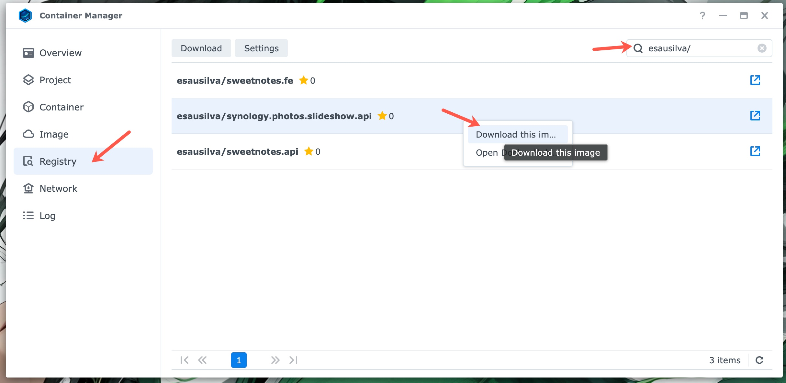
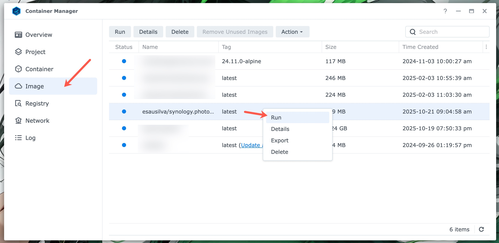

# Synology Photos Slideshow API

> An API to randomly fetch and serve images from Synology NAS devices, optimized for use in slideshow applications.

The idea behind this API is to download a set of photos picked at random from your Synology NAS device to be displayed in a client slideshow application.

This set of photos can be refreshed at any time by calling the `Download Photos` endpoint.

The API is meant to be deployed on a Synology NAS device on your local network and accessed from within your local network.

I have the API deployed and tested in Synology Container Manager, but it should work on any Docker host. i.e. Portainer.

I will be creating a web client application that calls this API, but it really can be anything. (_coming soonish_)

## Endpoints

The API exposes two ports: **5097** for **HTTP** and **7078** for **HTTPS**. (HTTPS only working locally for now)

The API has two endpoints: **Download Photos** and **Get Photo URLs**.

The base URL is `http://<your-nas-ip>:5097`. When running the API for local development, replace the NAS IP with `localhost`.

### Download Photos

```text
/download-photos
```

This endpoint randomly selects and downloads photos from a specified folder(s) on your Synology NAS device. The downloads are placed in a specified folder where the API has access to.

Every time this endpoint is called, it will download a new set of photos and replace the old ones. 

See "[Local Development](#local-development)", "[Local Testing with Docker](#local-testing-with-docker)", and "[Deployment](#deployment-to-your-synology-nas-device)" for more information on configuration.

Note: There is an issue with the number of photos to download. It seems to be limited to 79; however, this number limit works for now. I will look into this later and try to figure this out.

#### Response Codes

- 204: Success
- 503: Error. This is returned if the API is unable to download photos due to issues with the official Synology API. i.e., timeouts.
- 500: Error. Any other unexpected errors.

An example of the error response:

```json
{
  "type": "https://datatracker.ietf.org/doc/html/rfc9110#status.503",
  "title": "Failed to download photos.",
  "status": 503,
  "detail": "Search operation timed out after 10 attempts",
  "traceId": "00-d1f393c5f6b5377af412bee5a15cd61d-89602e76756bbe5c-00"
}
```

```json
{
  "type": "https://datatracker.ietf.org/doc/html/rfc9110#status.503",
  "title": "An error occured",
  "status": 500,
  "detail": "[Error message]",
  "traceId": "00-d1f393c5f6b5377af412bee5a15cd61d-89602e76756bbe5c-00"
}
```

### Get Photo URLs

```text
/get-photo-urls
```

This endpoint returns a list of photo URLs that can be used in a client slideshow application.

It will return the photos previously downloaded by the `Download Photos` endpoint.

#### Response Codes

- 200: Success
- 500: Error. Any unexpected errors. _See the previous endpoint for an example._

An example of the success response:

```json
[
  "/slideshow/20230921_163859.jpg",
  "/slideshow/20231211_165956.jpg",
  "/slideshow/20231231_195740.jpg",
  "/slideshow/20240317_165238.jpg",
  "/slideshow/20240618_141316.jpg"
]
```

To form the full URL in the client application, you would need to concatenate the base URL with the photo URL.

```text
http://<your-nas-ip>:5097/slideshow/20240618_141316.jpg
```

## Logging

The API logs to a file in a `logs` folder, and will create it relative to the deployment root if it doesn't exist; it will also place a JSON file in the `logs` folder per day.

The file name format is `api-logs_20251006.json`.

I might switch this to a database in the future. But for now, it's good enough.

## Local Development

Update the following app settings in `appsettings.json` or create a .NET User Secrets (Secret Manager) file:

```json
{
  "UriBase": {
    "ServerIpOrHostname": "<<SERVER_IP_OR_HOSTNAME>>",
    "Port": 5000
  },
  "SynologyUser": {
    "Account": "<<ACCOUNT>>",
    "Password": "<<PASSWORD>>"
  },
  "SynoApiOptions": {
    "FileStationSearchFolders": [
      "/path/to/server/photos"
    ],
    "NumberOfPhotoDownloads": 10,
    "DownloadAbsolutePath": "/path/to/slideshow/downloads"
  }
}
```

- `UriBase.ServerIpOrHostname`: The IP or hostname of your Synology NAS device.
- `UriBase.Post`: The default for Synology NAS devices is **5000**. If you are using a different port, update this value to match.
- `SynologyUser.Account`: The username for your Synology NAS device. It can be your main account or a service account with enough privileges to access files.
- `SynologyUser.Password`: The password for your Synology NAS device.
- `SynoApiOptions.FileStationSearchFolders`: A list of folders on your Synology NAS device to search for photos. Must be absolute paths.
- `SynoApiOptions.NumberOfPhotoDownloads`: The number of photos to download.
- `SynoApiOptions.DownloadAbsolutePath`: The absolute path to download the photos to. This must exist even before the API is run, otherwise it will throw an exception at bootup.

Refer to [Endpoints](#endpoints) on how to call the API endpoints.

## Local Testing with Docker

The `dockerfile` has instructions to create the `SynoApiOptions.DownloadAbsolutePath` folder. It will create it at the root of the deployment folder: `/app/slides`.

The `docker-compose.yml` file is already setting up an environment variable for the `SynoApiOptions.DownloadAbsolutePath` folder pointing to `/app/slides`.

I suggest creating a `docker-compose.local.yml` file to override some of the other app settings variables. Which is what I am doing, but not including in the repo.

This is a sample of the `docker-compose.local.yml` file:

```yaml
services:
  synology.photos.slideshow.api:
    image: esausilva/synology.photos.slideshow.api:local
    environment:
      - UriBase:ServerIpOrHostname=<<SERVER_IP_OR_HOSTNAME>>
      - UriBase:Port=<<CUSTOM_PORT>>
      - SynologyUser:Account=<<ACCOUNT>>
      - SynologyUser:Password=<<PASSWORD>>
      - SynoApiOptions:FileStationSearchFolders:0=<<PATH_TO_PHOTOS_FOLDER_IN_NAS>>
      - SynoApiOptions:FileStationSearchFolders:1=<<PATH_TO_PHOTOS_FOLDER_IN_NAS>> ## If you have more than one folder to search
      - SynoApiOptions:NumberOfPhotoDownloads=10
    volumes:
      - ./.slides:/app/slides
      - ./.logs:/app/logs

```

Volumes are optional, but I find them useful to be able to access the downloaded photos and logs.

To build the image, run the following command:

```shell
docker-compose -f docker-compose.yaml -f docker-compose.local.yaml build
```

To create the container and start it, run the following command:

```shell
docker-compose -f docker-compose.yaml -f docker-compose.local.yaml up -d
```

`-d` is optional if you want to run the container as a detached (background) process.

Note: It would be a good idea to rename the image on both Docker compose files and remove my name from the image name.

## Deployment To Your Synology NAS Device

Two options:

1. Download the latest image from my Docker Hub: [esausilva/synology.photos.slideshow.api](https://hub.docker.com/r/esausilva/synology.photos.slideshow.api).
2. Build the image yourself and push it to your own Docker Hub repository. Following this route you will need to rename the image to match your repository in the `docker-compose.yml` file. 

**For option 2:**

Run the following command to build the image:

```shell
docker-compose build
```

This will take the default docker compose file, `docker-compose.yaml`, and build the image, skipping the local docker compose file, `docker-compose.local.yml`.

Run the following command to push the image to your Docker Hub repository:

```shell
docker push [your-repo]/synology.photos.slideshow.api:latest
```

**For both options:**

From Synology Container Manager, click on the "Registry" tab and search for the appropriate repository and image.

Right-click on the image and select "Download this image".



Once the image is downloaded, you can create a container from it by going to the "Image" tab, then right-clicking on the image and selecting "Run".



From there, you can configure the container. In the first screen you will need to set the container name, I would suggest checking-off the "Enable auto-restart" option.

On the second screen, configure the local (to the NAS) ports. You can choose to use the default ports, or you can change them to whatever you want. Just be mindful that the API endpoint ports will need to match the ports you configure here.

Setting up volumes is optional, but I find them useful to be able to access the downloaded photos and logs. You will need to create the folders at your desired location in the NAS with File Station, then map them to the container by clicking the "Add Folder" button under the "Volume Settings" heading.

The volume maps in the container will  be `/app/slides` and `/app/logs`, make sure you assign Read/Write permissions to the volumes.

Finally, you need to configure the environment variables under the "Environment" heading.

The environment variables will be as follows:

| **Environment Variable**                  | **Value**                        |
| ----------------------------------------- | -------------------------------- |
| ASPNETCORE_URLS                           | http://+:5097                    |
| UriBase:ServerIpOrHostname                | [[SERVER_IP]]                    |
| UriBase:Port                              | 5000                             |
| SynologyUser:Account                      | [[ACCOUNT]]                      |
| SynologyUser:Password                     | [[PASSWORD]]                     |
| SynoApiOptions:FileStationSearchFolders:0 | [[PATH_TO_PHOTOS_FOLDER_IN_NAS]] |
| SynoApiOptions:NumberOfPhotoDownloads     | 79                               |
| SynoApiOptions:DownloadAbsolutePath       | /app/slides                      |

## Important !!!!!!!

I highly suggest you create a DHCP reservation in your router for the IP address of your Synology NAS device.

This will make it predictable and not change every time you restart your NAS, or the IP address changes.

## Future Enhancements

The API is pretty much an MVP. I would like to add the following features (in no particular order):

- Scheduled jobs to download a new set of photos in the background, configurable to run every X number of days. This is because the current process is to manually call the download endpoint, and I'd like to automate this process to run once a week.
- Have SignalR to notify the client when a new set of photos is available. A predecessor to this is to have the background job feature mentioned above completed.
- Have a "permanent photos" folder that will not be cleaned by the `Download Photos` endpoint. This is to allow me to upload photos manually from my phone or computer and have them be available to the slideshow application. Say we recently took a trip and I want to display photos from that trip alongside the randomly selected photos. These photos will be available until manual deletion.
  - For this to work, the volume mapping to `/app/slides` is required, so I have access to the slides folder from the NAS device and use Synology Files on my phone to upload the photos, or DSM from the computer browser.
- A delete endpoint to remove photos from the slideshow. Note that this will only delete the photos from the slideshow (`SynoApiOptions:DownloadAbsolutePath`), not the actual photos on the NAS device. 
- Refactor the `Get Photo URLs` endpoint to return metadata about the photos. To include the photo's date taken and the photo's location.
  - This is to display an overlay on each photo with the date and location. Possibly a link to Google Maps with the location.
- A "blacklist" endpoint to prevent certain photos from ever being displayed. Say, you see a photo in the slideshow that you don't want to display, ever. The endpoint would delete and add it to the blacklist, so it will not be downloaded again.
- What else? Will see...

## Client App

Not yet created. I will post an update and a link to the repo once it's ready.

It will be a web app, so I can access it on a Raspberry Pi and have it on my kitchen/dining counter area.

## Shameless Plug

I am using my own Synology API SDK to do the heavy lifting of interacting with the official Synology API to fetch the photos and request the download.

Check it out: 

- GitHub Repo: [Synology API SDK](https://github.com/esausilva/synology-api-sdk)
- NuGet Package: [Synology.API.SDK](https://www.nuget.org/packages/Synology.API.SDK)

## Giving Back

If you find this project useful in any way, consider getting me a coffee by clicking on the image below. I would really appreciate it!

[](https://www.buymeacoffee.com/esausilva)
