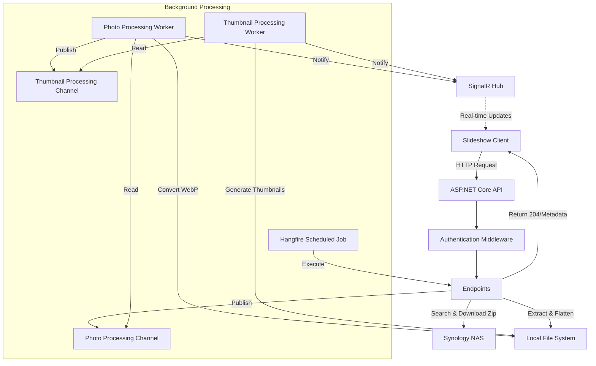
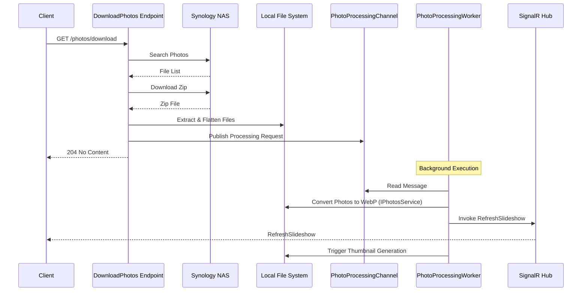
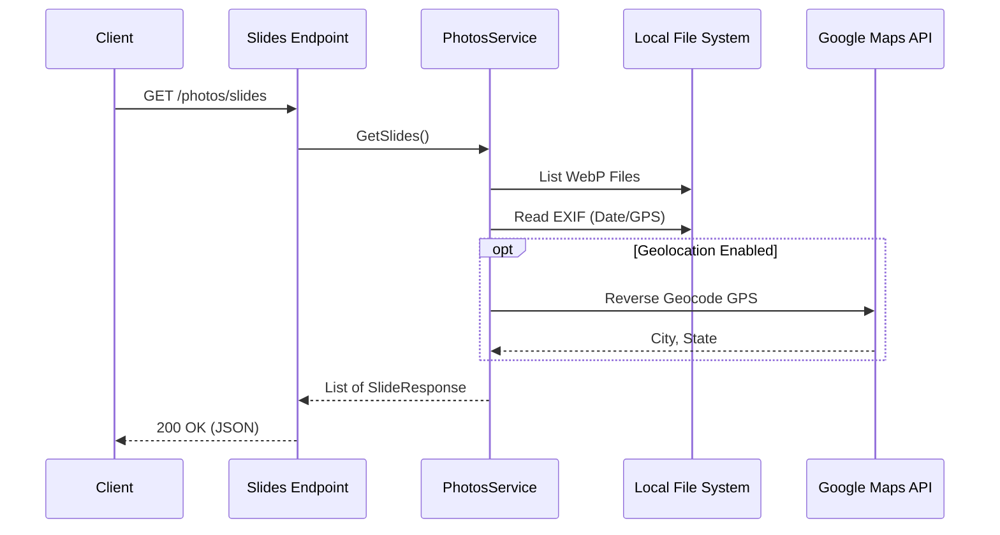
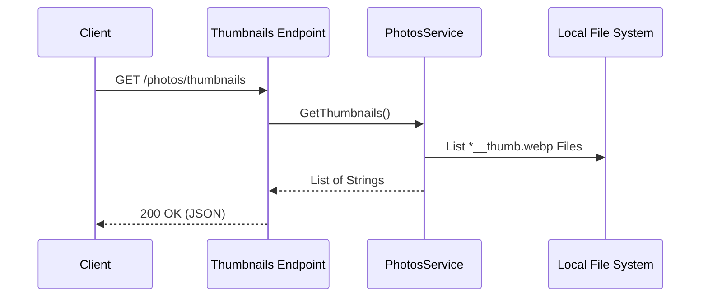
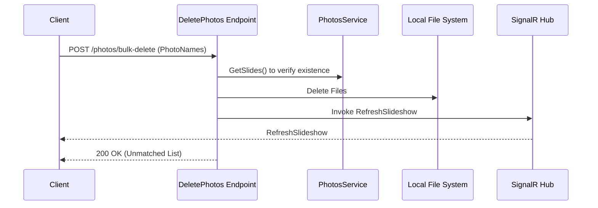
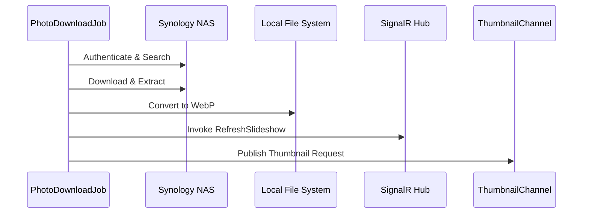

# Architecture Overview

The Synology Photos Slideshow API follows a decoupled architecture using background workers and channels for long-running photo processing tasks.

## System Architecture

---

## Call Flows

### 1. Download Photos (`GET /photos/download`)

This flow handles the initial discovery, download, and asynchronous processing of photos.

### 2. Get Photo Slides (`GET /photos/slides`)

Retrieves metadata and locations for currently processed photos.

### 3. Get Thumbnails (`GET /photos/thumbnails`)

Retrieves the list of available thumbnail URLs.

### 4. Bulk Delete Photos (`POST /photos/bulk-delete`)

Deletes specific photos from the local cache.

### 5. Scheduled Job (`Hangfire`)

Automated weekly download flow.

