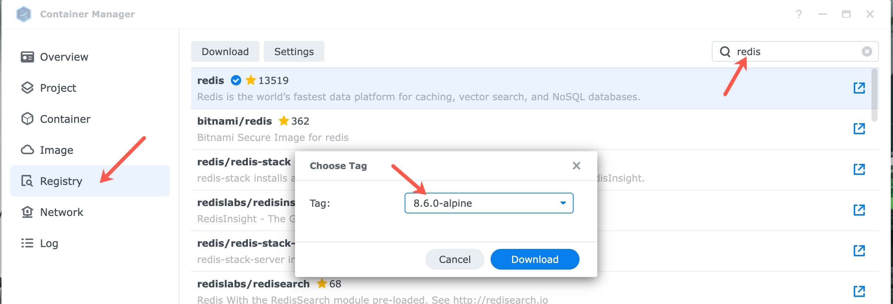
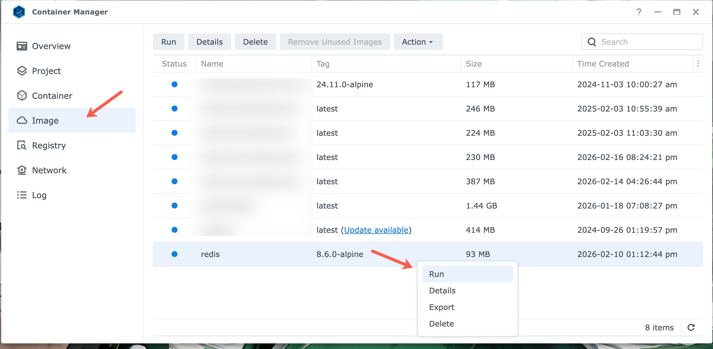

# Redis

Redis is optional and **disabled by default**. Enable it only if you want distributed caching for geolocation lookups.

Prerequisite: read [Photo location](photo-location.md) first to understand when geolocation is used.

## Enable Redis

Set:

```json
{
  "ThirdPartyServices": {
    "EnableDistributedCache": true
  },
  "ConnectionStrings": {
    "Redis": "<<REDIS_CONNECTION_STRING>>"
  }
}
```

If disabled, the API still uses in-memory caching only.

**Note**: I am using Redis 8.6.0, but you can use whatever version you like.

### Connection strings

Examples:

- Local container: `localhost:6379,abortConnect=false,connectTimeout=10000`
- Docker Compose service: `redis.slideshow:6379,abortConnect=false,connectTimeout=10000`
- Synology NAS: `[[SERVER_IP]]:6379,abortConnect=false,connectTimeout=10000`

## Run Redis locally (Docker)

```shell
docker run -d --name redis -p 6379:6379 -v redis-data:/data redis:8.6.0-alpine redis-server --appendonly yes
```

The project's `docker-compose.yaml` includes a Redis service for local development and an override in the `docker-compose.local.yml` file that will use the `redis.slideshow` network if you run this API with Docker Compose.

Refer to [Docker Local](../README.md#docker-local) for a sample of the `docker-compose.local.yml` file and the commands to build and run the API with Docker Compose.

## Running Redis on your Synology NAS

From Synology Container Manager, click on the "**Registry**" tab and search for the appropriate repository and image.

Right-click on the image and select "Download this image" then select "8.6.0-alpine".



Once the image is downloaded, you can create a container from it by going to the "**Image**" tab, then right-clicking on the image, and selecting "**Run**".



From there, you can configure the container. In the first screen you will need to set the container name, I would suggest checking-off the "**Enable auto-restart**" option.

On the second screen, configure the local (to the NAS) ports, which in this case is `6379`.

Setting up volumes is optional, but you can configure them to store the cache data on your NAS. You will need to create the folders at your desired location in the NAS with File Station, then map them to the container by clicking the "**Add Folder**" button under the "**Volume Settings**" heading.

The volume map in the container will  be `/data`, make sure you assign Read/Write permissions to the volume.

One last configuration if you choose to store the cache data on your NAS, assign the following command to the "**Command**" field under "**Execute Command**" heading:

```text
redis-server --appendonly yes
```

Refer to [Deployment To Your Synology NAS Device](../README.md#deployment-to-your-synology-nas-device) for API environment variable configuration and more details.

## GUI client (optional)

Another Redis Desktop Manager (ARDM) is a free, open-source, and cross-platform GUI client: https://goanother.com/

Support the project if you are able to.
